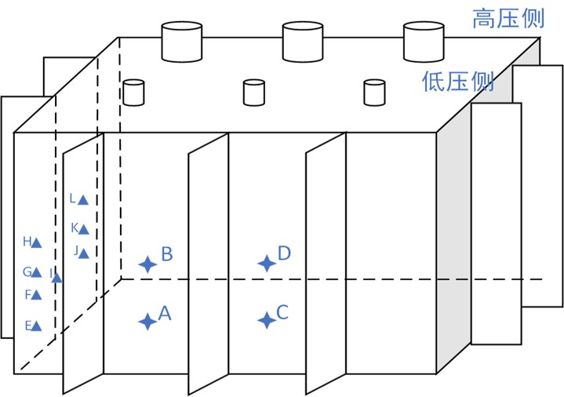

<html>
	<head>
		<meta charset="utf-8" />
		<title>实时监测</title>
		
	</head>
	<body>
		<h1>基于sm掺杂pmn-pt压电取能的变压器振动感知终端研制</h1>		
		
<b>点击相应位置的图标</b>实时监测页面(A、B、C可点击)

		

		出错了

		  
		

			或点击这里
			<a href="./js/A.js" target="_blank">A</a>,
			<a href="./js/B.js" target="_blank">B</a>,
			<a href="./js/C.js" target="_blank">C</a>
		

		
			
			
			
			<map name="position" id="position">
			
			<area
			shape="circle"
			coords="158,400,12"
			href ="./html/A.html"
			target ="_blank"
			alt="A" />
			
			<area
			shape="circle"
			coords="158,335,12"
			href ="./html/B.html"
			target ="_blank"
			alt="B" />
			
			<area
			shape="circle"
			coords="280,400,12"
			href ="./html/C.html"
			target ="_blank"
			alt="C" />
			
			</map>
		

		

			又或点击这里
			<a href="js/A.js" target="_blank">A</a>,
			<a href="js/B.js" target="_blank">B</a>,
			<a href="js/C.js" target="_blank">C</a>
		

		
数据

		

			加速度最大振动幅值
			&nbsp;&nbsp;加速度峰值
		

		
		
变压器状态

		

		正常
		故障
		

	</body>
</html>
